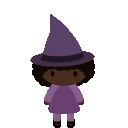

## Planering

## Beskrivning
"Cat conjurer: A witch's tale" är en platformer som har temat halloween.
Målet är att man ska rädda katter från sjunkande pedelstaler i ett träsk.
Samtidigt som du undviker kråkor och fiender. 

## Målgrupp
Spelet är riktat mot målgruppen mellan 8-15 år skulle jag säga. Spelets "artstyle" och design är väldigt barnvänligt på så sätt att det inte finns något grovt i de. Spel kontrollerna är lätt att förstå: det går att hoppa och gå åt sidorna. 

Konceptet är för simpelt så att åldrarna över skulle tycka att spelet är för tråkig.

## Funktioner

Spelet innehåller delar som behöver koder var för sig
Några exemplar funktioner är:
* [] en funktion som skapar nya fiender
* [] Funktioner och inputs för spelaren
* [] Hur många katter som har blivit insamlade
* [] En kamera som följer efter spelaren
* [] Pedistalerna som katterna sitter på ska sjunka
* [] Något som registrerar hitboxes
* [] Animationer för katten och häxan

## Design & Struktur
Grafiken får vi från de andra i gruppen som är ansvariga över grafiken. Här är en prototyp som vi har fått hitills:

Det är spelkaraktären som du spelar som.

Behöver definitivt mera grafik för marken, pelaren, katterna och krokodilerna.
Tänker att spelet ska åtminstone ha 1 sprite som är animerat om det finns tid över.

För att få en så stabil kod som möjligt så börjar man från grunden och bygger uppåt, blir också lättare att felsöka. Så koden börjar med en game klass som är den som samlar in all information och ritar ut dem.
När grafiken levereras så kan byter jag ut dem i deras respektiva klasser. Så Krokodilerna som är fienderna, hamnar i fiender klassen. Vilket ska innehålla hur dem rör sig och vad som händer om dem rör spelaren. Detsamma gäller för resterande spritsen.

## Ordningsplanering
Har redan en stor del av koden som behövs redan, men det finns kvar delar som behövs och göra. Som en funktion för katterna som ska agera som "poäng".  Sen så finns det grejer som behöver justeras innan det börjar se ut som ideen vi hade, som: plattformarna som existar ska formas om och blir pelare. Dessutom så ska dem åka neråt.

Så det som finns kvar och göra är:
* En kamera som följer efter spelaren
* Ta bort koder som är irrelevanta
* Lägga till spritsen och animera
* poäng räknare för katter
* game over och starta om
* justeringar

Utan massa error koder som är jobbiga så estimerar jag att själva kodandet kommer gå relativt snabbt. Det är dock justeringarna som kommer var tidskonsumerande. Kommer behöva all tid som man får.

